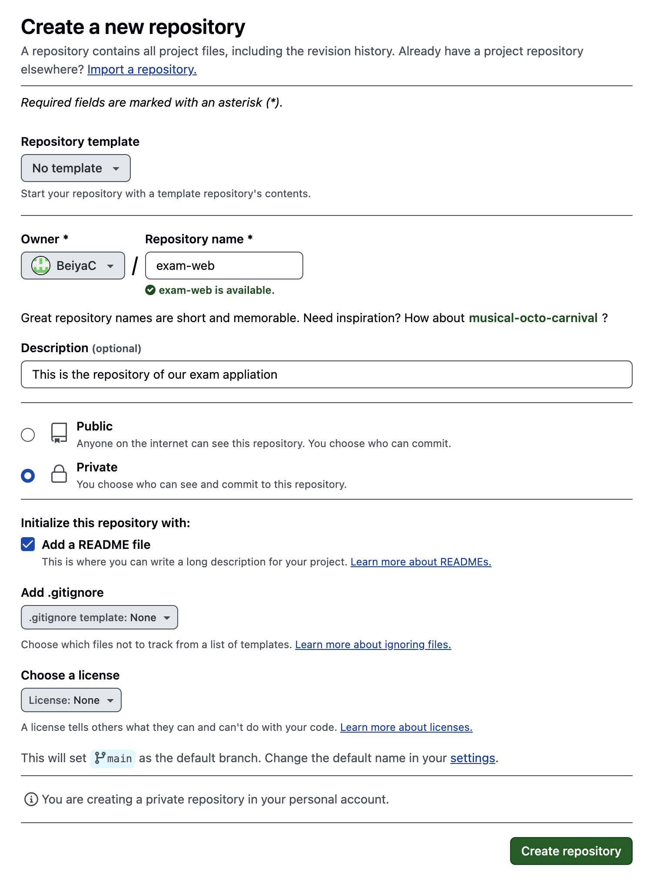
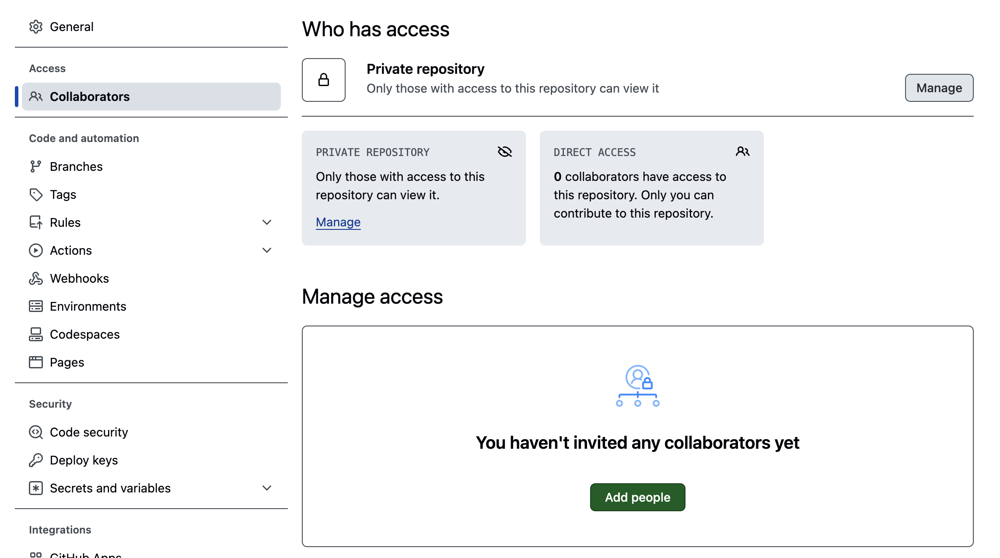
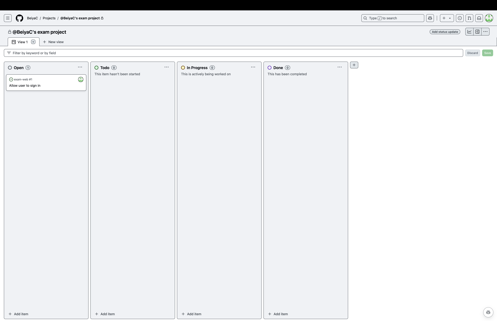
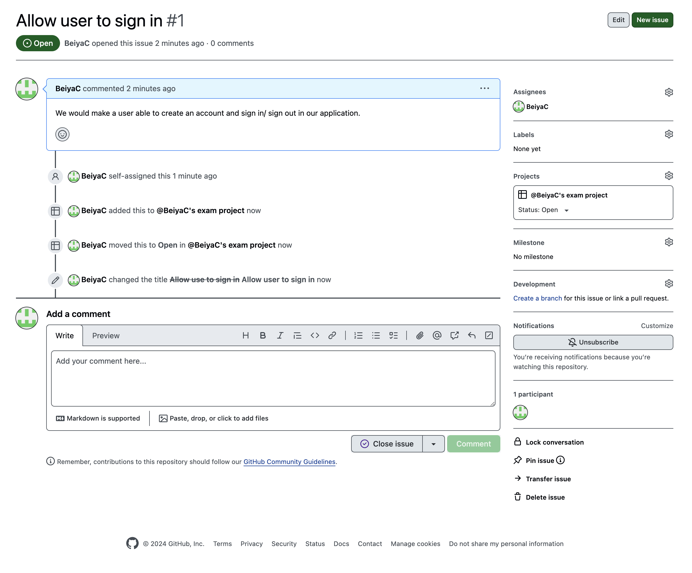
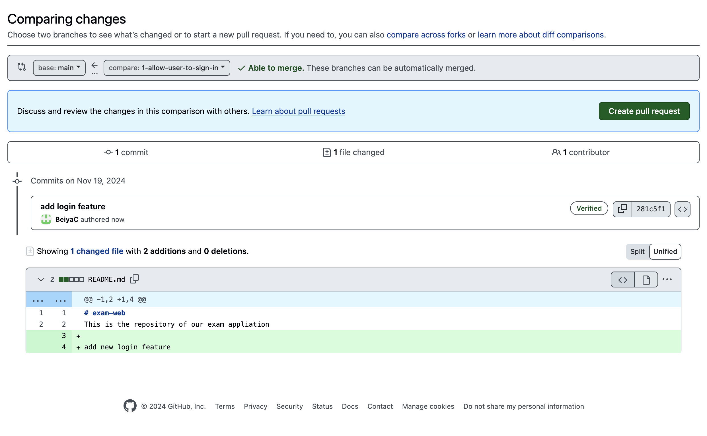
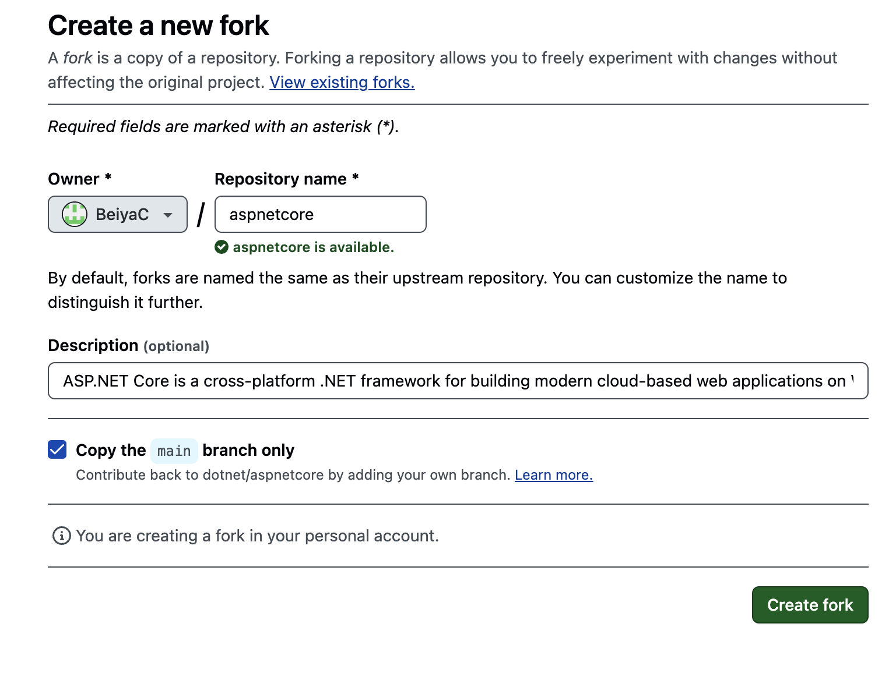
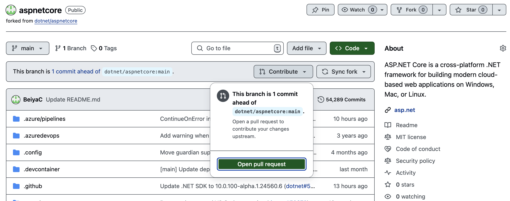
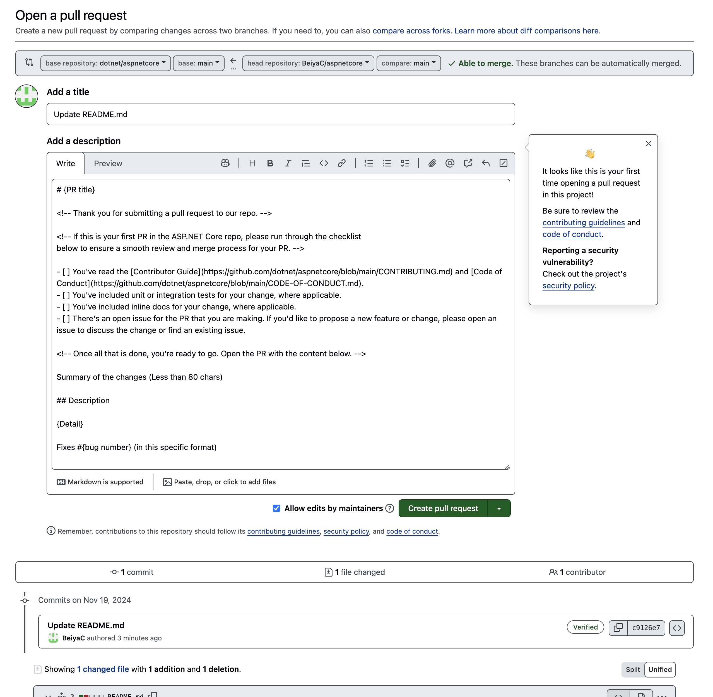

# Exam-web
This is the repository of our exam application

## Scénario


En suivant le scénario suivant, expliquez ce que vous feriez dans cette situation. Il faudra détailler vos choix et ce qui sera mis en place. Il faudra bien intégrer à vos réponses les commandes git que vous lancerez, et vous pouvez ajouter des caputres d’écran de vos terminaux et/ou de l’interface du Github.


``` 
Vous êtes embauché en tant que Lead Developper pour une toute nouvelle start-up.
Vous êtes donc en charge de la structure du code et de l’organisation de ce nouveau projet innovant.
Vous décidez d'héberger ce projet sur Github afin de pouvoir collaborer avec votre équipe de manière efficace.
Vous devez choisir vous-même l’utilisation et l’organisation que vous aurez avec Git et Github. Pas besoin de suivre à 
la lettre celle vue en cours, mais il faudra dans tous les cas expliquer et justifier vos choix. 
```

## Questions

### 1. Expliquez les premières étapes menant à la création du projet Github et comment le reste de l'équipe va pouvoir installer le code sur leurs machines et commencer à travailler.

Pour pouvoir commencer à gérer le projet, je vais dans un premier temps créer le "repository", qui sera l'espace dans lequel
nous partagerons toute notre codebase.
Etant une société, il est important que le repo soit en private afin de ne pas exposer des données sensibles au reste du monde.




Ensuite, nous irons ajouter tous les devs qui travaillent sur le projet pour le donner le droit de voir et de cloner.



L'idéal est d'ajouter un read.me qui permettra de détailler toutes les étapes pour la mise en place de la codebase.
Les collaborateurs devront faire la commande suivante pour pouvoir commencer à travailler sur le projet: 
```
git clone git@github.com:BeiyaC/exam-web.git
```

### 2.Votre équipe est pour l’instant composée de 5 développeurs. Comment vous organisez-vous afin de pouvoir travailler de manière simultanée sans vous marcher sur les pieds ?

Afin de travailler, nous utiliserons une des méthodes agiles qui consiste à utiliser un tableau dans lequel nous retrouvons
des tickets qui comportent les détails de la tâche à réaliser.



Les tickets peuvent êtres attribués à un dev et vont nous permettre d'aller faire de l'intégration continue en découpant au
maximum toutes les fonctionnalités que nous allons dev.



Afin de faciliter le travail la branch master sera une replic de notre branch production.
Une fois que le dev a son issue, il devra créer sa branch en partant de bien de l'origine qui est à jour pour commencer à 
travailler dessus avec les commandes:
```
git checkout master
git fetch
git checkout -b allow-user-to-sign-in
```

Il aura donc juste à commit son travail au fur et à mesure et push de manière régulière.
```
git add .
git commit -m "user is now able to create an account"
git push
```

### 3. Quelle démarche suivrez-vous afin de mettre en production vos features une fois les tests validés ?

Pour faciliter le process et protéger le bon fonctionnement de notre application. Les devs devront à chaque fois faire leur
pull request sur une branch main qui est une copie de la branch production.
Cela nous permet de nous assurer et de tester les features avant qu'elles ne partent en production.

Nous aurons également une autre branch bac à sable appelé main2 qui elle permettra de pouvoir pousser son code sans pull request
et de faire des essais rapides sans pénaliser la branch main. 
Il faudra bien évidemment veiller à la remettre à jour régulièrement.


### 4. Un stagiaire a travaillé sur une nouvelle feature dans son coin, avant de mettre ses modifications en production vous souhaiteriez vérifier le code qu'il a produit, quelle démarche suivez-vous ?

Donc notre branch est créée et nous avons terminé le travail réalisé et nous avons testé rapidement sur main2.
Nous allons donc pouvoir créer notre pull request:



Une fois que celle ci sera review, elle pourra être merge sur main et nous pourrons commencer toute la partie de tests avancés.
Des que nous serons sûr de notre feature nous pourrons créer une pull request de main à production pour la rendre utilisable
par tous les utilisateurs de l'app.

### 5.Pour la prochaine mise à jour de votre app vous souhaitez intégrer plusieurs features à la fois (développées par plusieurs développeurs différents). En essayant de fusionner ces features vous êtes confrontés aux conflit suivant. Comment le résolvez-vous (écrivez le résultat final) ?
```
const calculatrice = require('package_inutile')
function addition(a, b){
<<<<<<< HEAD
return a + b
=======
calculatrice.addition(a, b)
>>>>>>> awesome_feature_2
```
Résultat:

```
const calculatrice = require('package_inutile');

function addition(a, b) {
    return calculatrice.addition(a, b);
}
```

### 6. Rebelote, un nouveau conflit. Comment le gérez vous ?
```
<<<<<<< HEAD
// Cette fonction est essentielle pour la feature 1 !
function added_function(){
console.log("🙈")
}
=======
// Cette fonction est essentielle pour la feature 2 !
function another_method(){
print("🙈")
}
>>>>>>> awesome_feature_2
```
Résultat:
```
// Cette fonction est essentielle pour la feature 1 !
function added_function() {
    console.log("🙈");
}

// Cette fonction est essentielle pour la feature 2 !
function another_method() {
    console.log("🙈");
}
```

### 7. Alors que vous étiez en plein en train d'écrire l'algorithme le plus complexe de votre vie sur votre branche, votre patron vous demande d'impérativement corriger un bug et de déployer la correction au plus vite. Il vous semble que votre collègue Herbert l'avait corrigé dans sa branche 'other_feature'. Comment procédez-vous ?
#### Note : Vous ne souhaitez pas faire un commit avec les changements que vous êtiez actuellement en train de faire pour ne pas polluer l'historique.

Afin de pouvoir procéder au changement demander je vais dans un premier temps mettre de côté mon travail pour le récupérer plus
tard avec:
```
git stash
```

Je vais ensuite me rendre sur la branch de mon collègue:
```
git checkout other_feature
```

Si sa branch est bien à jour et que son code est fonctionnel je vais alors pouvoir créer une pull request sur main. 
Sinon je vais tout simplement créer une branch en partant de la sienne:
```
git checkout -b bug-of-herbert
```
Garder que ce dont j'ai besoin par rapport à main et à la correction du bug et pousser ces changements:
```
git add .
git commit -m "resolve bug of herbert"
git push
```

Ensuite je vais pouvoir créer ma pull request sur l'interface de github attendre une review puis aller merge sur main pour
effectuer les tests d'avant production. Une fois ces tests réalisés, nous pouvons refaire une pull request de main à production
et merge sur la branch production.

Le bug est corrigé je peux donc revenir sur ma branch de travail ultra complexe et récupérer les changements que je
n'avais pas commit:
```
git fetch
git checkout ultra-complexe
git stash pop
```

### 8. Au cours du développement vous découvrez un bug dans un package que vous utilisez. Vous ne pouvez pas avancer sans la correction de ce bug, et décidez donc de corriger le bug vous même. Quelle est la démarche à suivre ?
#### Note : Il serait dommage de ne pas faire profiter à tout le monde de votre correction ;)

Pour un package qui est toujours en activité, je peux faire le choix de faire un fork du repo. 



Je vais ensuite pouvoir soit créer une branch, pousser mes changements dessus et ensuite merge cette branche
sur la branch principal de mon fork ou alors pousser directement sur cette dernière.
Une fois mon bug corriger je vais pouvoir créer une pull request directement depuis mon fork sur le repo
d'origine du package.



En suivant leur template je vais faire une description de mes changements et de ce que j'apporte afin de leur faciliter
la compréhension de ma pull request.



Cela arrive que cette procédure puisse prendre du temps à être validée. S'offre à moi deux solutions, soit je décide d'attendre
la procédure soit je fais le choix de me servir de mon fork comme package pour avancer dans mon travail.
